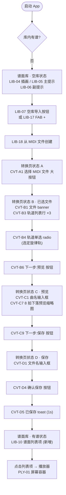
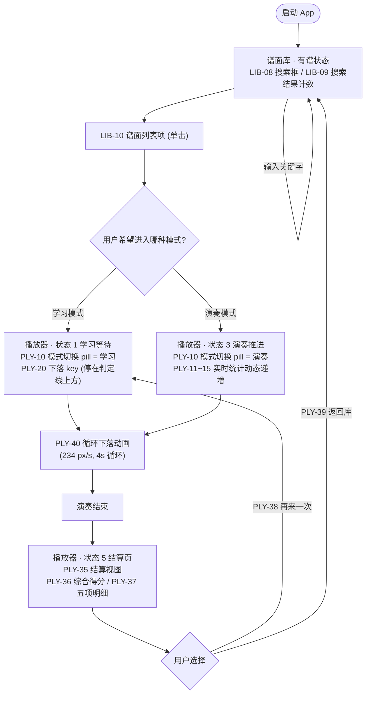
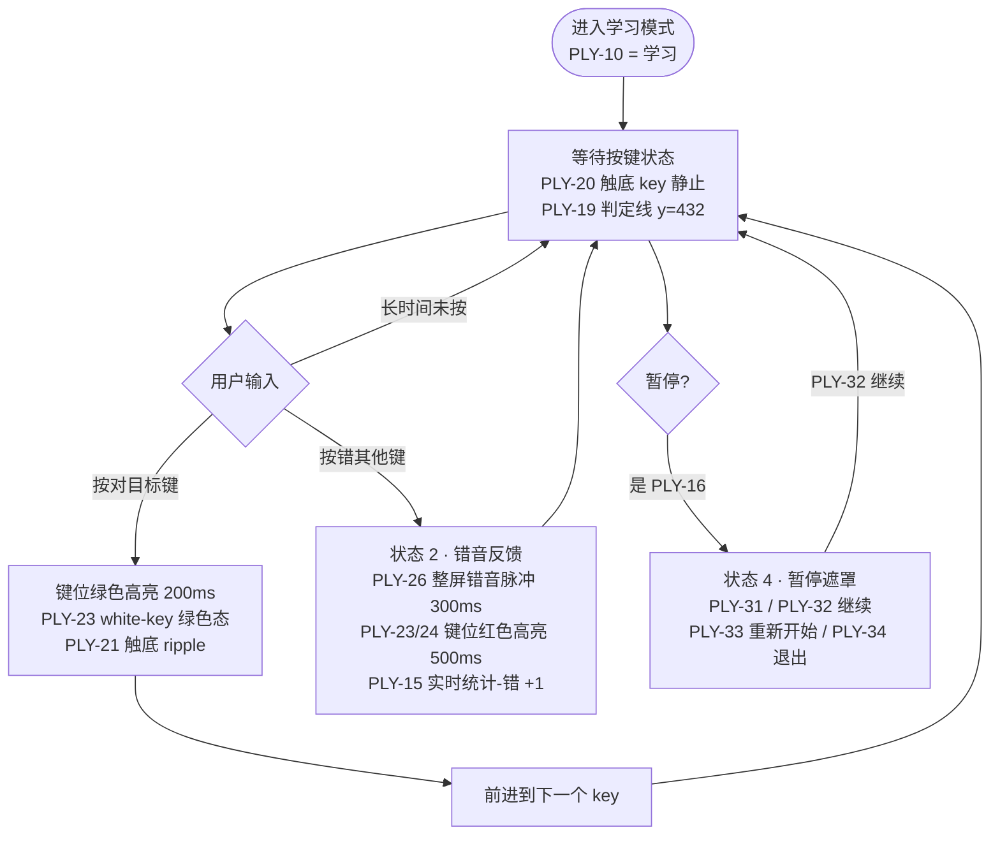
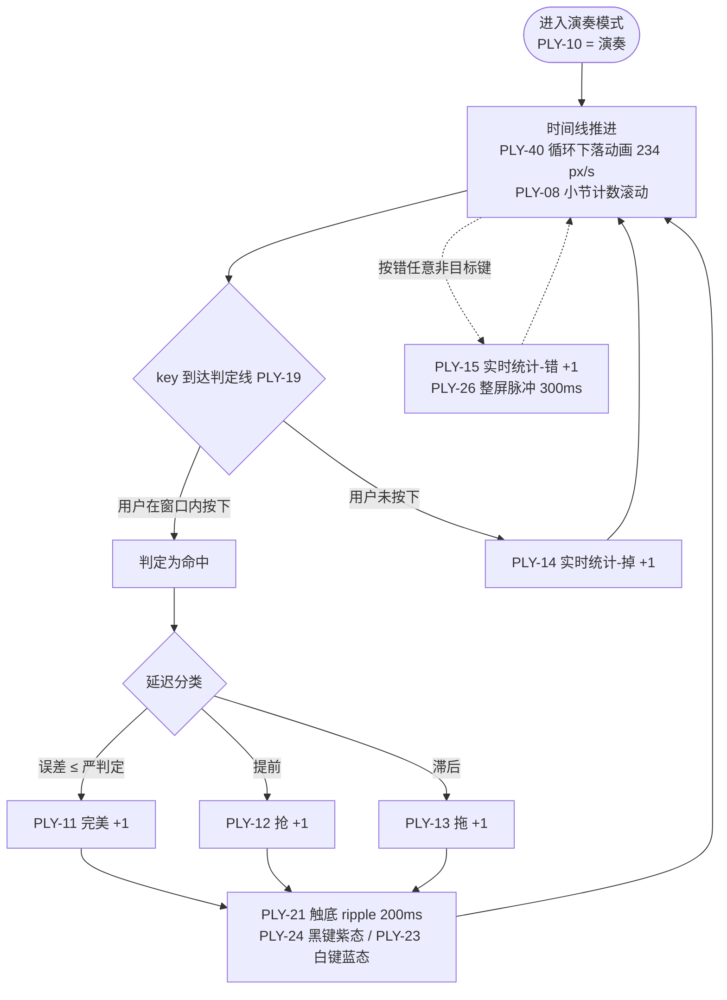
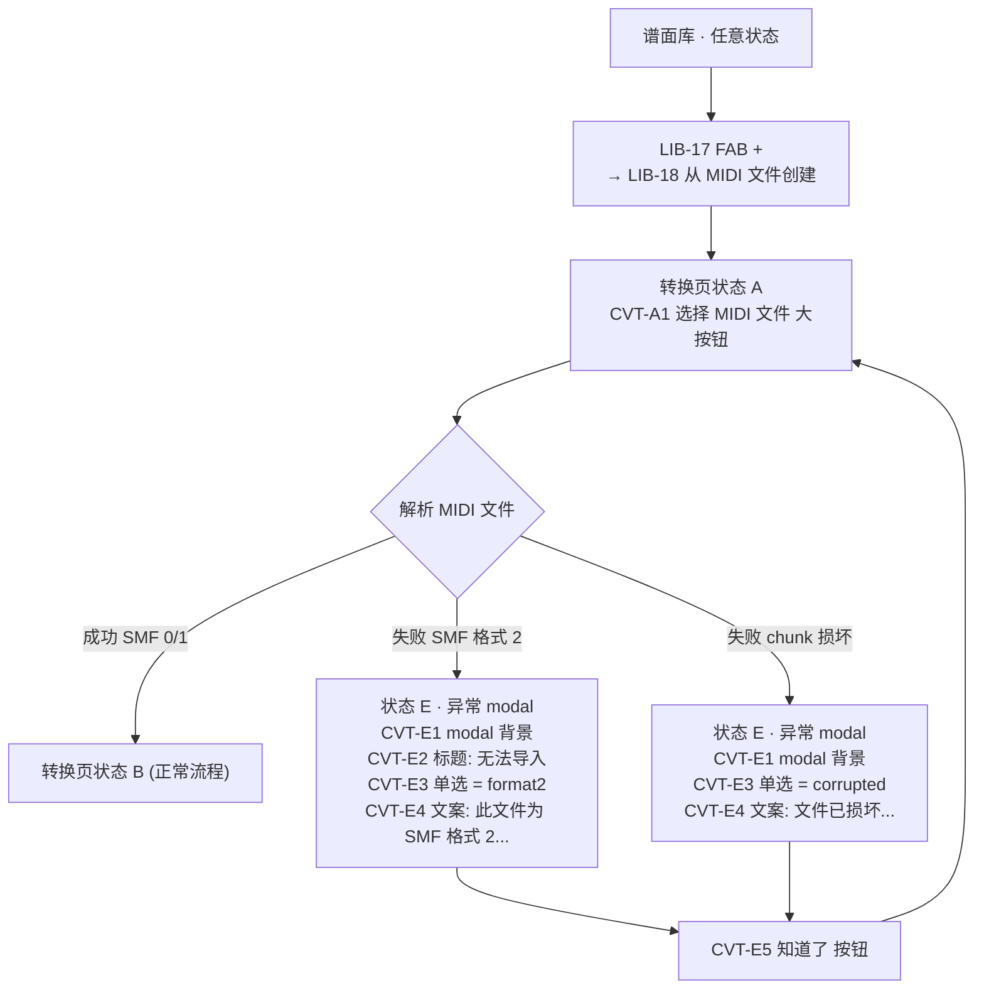
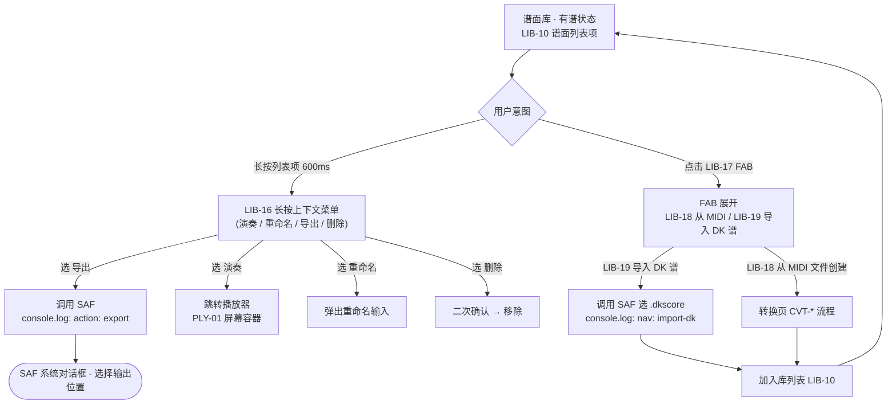

# KeyDrop_Piano v1.0.0 用户流程图

> 本文档以 Mermaid `flowchart` 描述 v1.0.0 视觉原型的 6 条关键用户路径,所有节点引用 SubStage 1.1 / 1.2 / 1.3 的真实元素编号 (LIB-* / SET-* / CVT-* / PLY-*)。
>
> 元素编号定义见各页面 HTML 文件底部 `========== 元素清单 ==========` 注释块。

---

## 1. 首次使用流程 (空库 → 导入 MIDI → 首次播放)

说明:首次启动 App 时,谱面库处于空库状态 (`LIB-04`/`LIB-05`/`LIB-06`),引导用户通过 `LIB-07` 或 `LIB-17` FAB 进入转换页。转换页依次经历 `CVT-A1 → CVT-B6 → CVT-C9 → CVT-D4` 四个关键操作,最后通过 `CVT-D5` toast 反馈,自动回到谱面库列表 (`LIB-10`)。

---

## 2. 日常使用流程 (有谱库 → 选谱 → 播放 → 结算)

说明:有谱情况下,通过 `LIB-08` 搜索过滤或直接点击 `LIB-10`,通过 `PLY-10` 模式 pill 切换学习/演奏。学习模式下 `PLY-20` 下落 key 会在判定线上方等待;演奏模式下 `PLY-11`~`PLY-15` 统计字段实时递增。结算页通过 `PLY-36` 显示综合得分,`PLY-38` / `PLY-39` 决定下一步。

---

## 3. 学习模式判定状态机

说明:学习模式核心特征是"按对前进、按错停留 + 闪红"。错音视觉反馈对应 `PLY-26`(整屏脉冲)+ `PLY-23` / `PLY-24` (键位红色高亮)+ `PLY-15` 错音统计自增。暂停由 `PLY-16` 触发遮罩 `PLY-31`,内含三按钮 `PLY-32` / `PLY-33` / `PLY-34`。

---

## 4. 演奏模式判定状态机

说明:演奏模式不停止时间线,key 自动消失。命中后细分为 `PLY-11 完美 / PLY-12 抢 / PLY-13 拖`,未按下计入 `PLY-14 掉`,按错任意非目标键独立计入 `PLY-15 错` 并触发 `PLY-26` 整屏脉冲。所有命中触发 `PLY-21` 触底 ripple 视觉反馈。

---

## 5. MIDI 导入失败流程 (异常处理)

说明:MIDI 解析失败有两种典型错误 (SMF 格式 2 / chunk header 损坏),都由 `CVT-E1` 异常 modal 承载,通过 `CVT-E3` 单选按钮在原型中切换显示哪条文案 (`CVT-E4`),`CVT-E5` 知道了按钮关闭弹窗回到状态 A 重新选文件。

---

## 6. 谱面导入导出流程 (SAF 与 DK 谱)

说明:导入导出统一走 Android SAF (Storage Access Framework)。`LIB-16` 长按菜单提供单条目操作 (含导出),`LIB-17` FAB 提供两种导入入口:`LIB-18` 从 MIDI 创建 (走 `CVT-*` 转换流程) 与 `LIB-19` 直接导入 DK 谱 (走 SAF 文件选择)。所有新增谱面最终都回流到 `LIB-10` 列表项中。

---

## 元素编号速查 (按页面)

| 页面 | 编号区间 | 文件 |
|---|---|---|
| 谱面库 | `LIB-01` ~ `LIB-20` | `pages/library.html` |
| 设置 | `SET-01` ~ `SET-15` | `pages/settings.html` |
| 转换页 | `CVT-01` ~ `CVT-05` (通用) / `CVT-A1`~`CVT-A2` / `CVT-B1`~`CVT-B6` / `CVT-C1`~`CVT-C9` / `CVT-D1`~`CVT-D5` / `CVT-E1`~`CVT-E5` | `pages/convert.html` |
| 播放器 | `PLY-01` ~ `PLY-40` | `pages/player.html` |

设置页编号 (`SET-01` ~ `SET-15`) 主要服务"调参"路径,不在上述 6 个主流程中,但任何流程都可由 `LIB-02` 设置入口侧向跳转 (例如:`LIB-02 → SET-06` 下落时长滑条 → 返回 `LIB-10` 重新选谱)。
